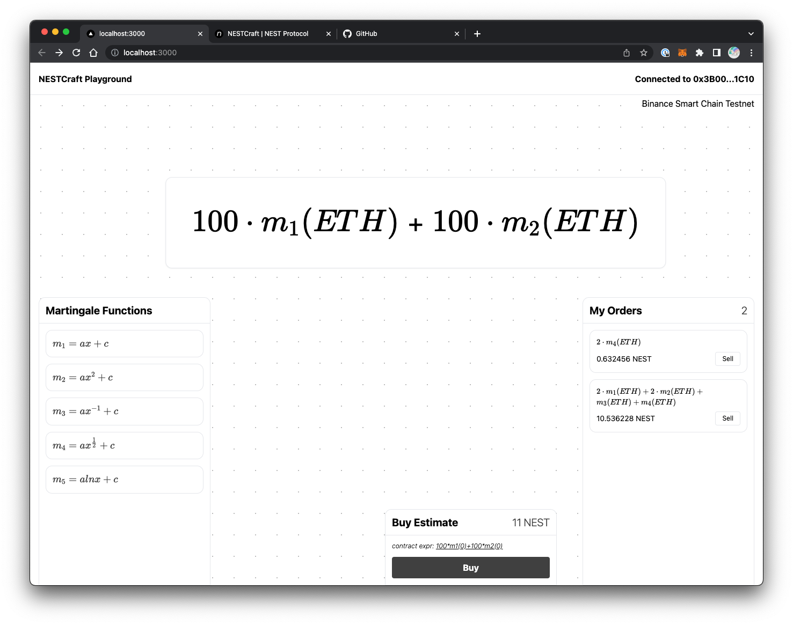

# NESTCraft-playground

A given random information flow can be transformed by various functions to obtain a series of martingales, which can be
used for the NEST martingale transactions. 



We call these functions for martingalizing random information flows martingale functions. If we relax the martingale standard and choose to accept more super martingales, the scope of
application of the trading will become larger, but unless these martingales are insensitive to traders, it is easy to
reduce demand and reduce the enthusiasm for participation. Of course, this only adds a variety of options for traders.
As long as someone accepts this design, it will provide more supply on the original basis.

## Usage

### 1.Install dependencies

```shell
npm install
```

### 2. Run development server

```shell
npm run dev
```

### 3. Choose a Martingale Functions

Click the ```Martingale Functions``` tab, you can see all the martingale functions. 
Example: 12 * m1(ETH)

### 4. Buy

Once you have chosen a martingale function, you can buy it. Remember to approve the amount of NEST first.

### 5. Sell

All of your orders will be displayed in the ```My Orders``` tab. You can sell your orders at any time.

## More
- [NEST White Paper](https://www.nestprotocol.org/doc/ennestwhitepaper.pdf)

Enjoy hacking!